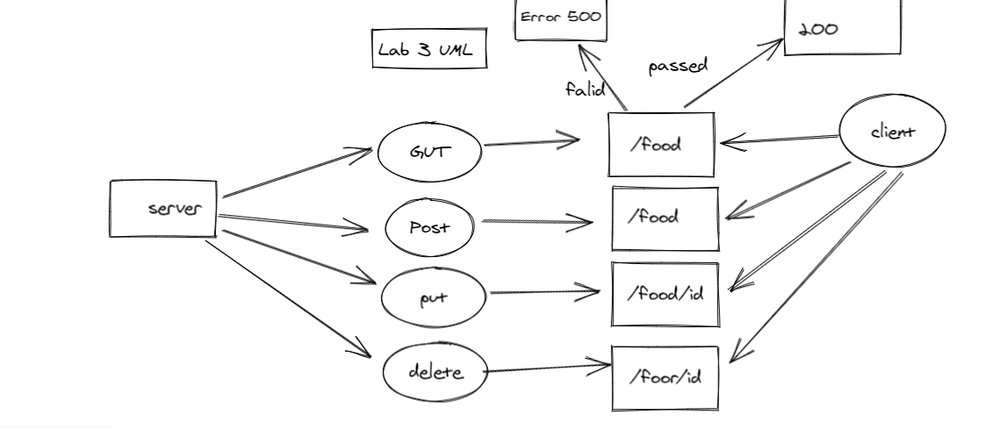
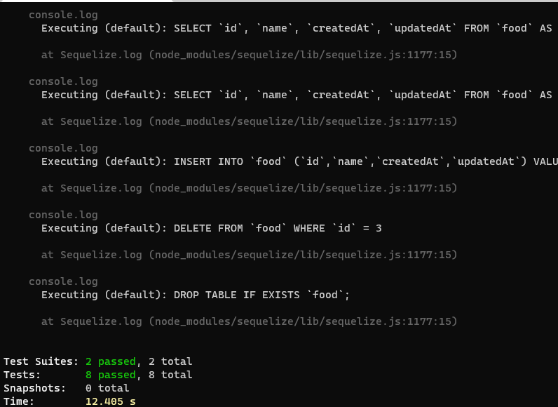

# basic-api-server

[Pull request](https://github.com/AseelAlasaad/basic-api-server/pull/1)

[Action](https://github.com/AseelAlasaad/basic-api-server/actions)

[Heroku main](https://basic-api-server-main.herokuapp.com/)

[Heroku dev](https://basic-api-serverdev.herokuapp.com/)

